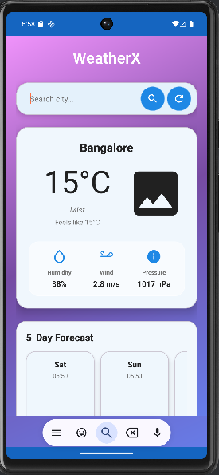
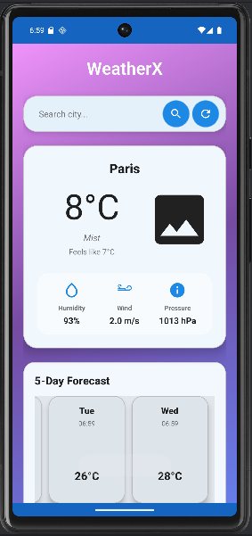
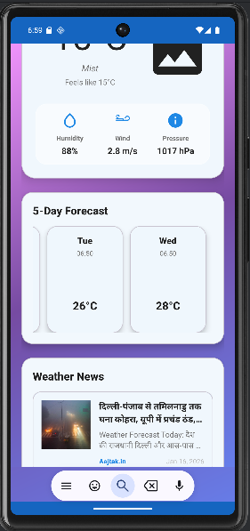
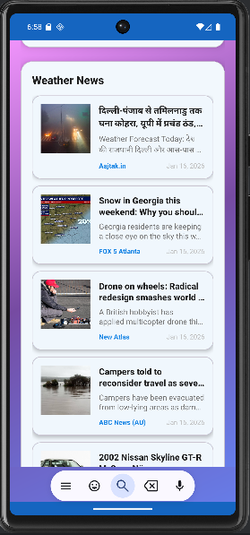

# 🌤️ WeatherX - Modern Android Weather Application

<div align="center">


[](https://android.com)
[](https://android-arsenal.com/api?level=24)
[](https://java.com)
[](https://developer.android.com/jetpack/guide)

*A beautiful, modern Android weather application built with Java using MVVM architecture*

[📱 Features](#-features) • [🏗️ Architecture](#️-architecture) • [🚀 Setup](#-setup) • [📸 Screenshots](#-screenshots) • [🛠️ Tech Stack](#️-tech-stack)

</div>

🔗 GitHub Repo: [Link](https://github.com/mr-piyushkr/WeatherX-Android-App.git)

📦 APK: [Link](https://github.com/mr-piyushkr/WeatherX-Android-App/releases/tag/v1.0.0-initial-release)

---

## ✨ Features

### 🌦️ **Weather Features**
- 🌍 **Real-time Weather Data** - Current weather conditions with live updates
- 🔍 **City Search** - Search weather for any city worldwide
- 📍 **Location-based Weather** - Automatic weather detection using GPS
- 📊 **5-Day Forecast** - Detailed weather predictions
- 🌡️ **Detailed Metrics** - Temperature, humidity, wind speed, pressure
- 🎨 **Weather Icons** - Beautiful weather condition icons
- 🔄 **Auto Refresh** - Real-time weather updates

### 📱 **UI/UX Features**
- 🎨 **Modern Material Design 3** - Latest design guidelines
- ✨ **Glassmorphism Effects** - Beautiful translucent cards
- 🌈 **Gradient Backgrounds** - Stunning visual effects
- 🌙 **Dark/Light Theme** - Automatic theme switching
- 📱 **Responsive Design** - Works on all screen sizes
- 🎯 **Intuitive Navigation** - User-friendly interface
- 💫 **Smooth Animations** - Fluid user experience

### 📰 **News Features**
- 📰 **Weather News** - Latest weather and climate news
- 🔗 **External Links** - Read full articles in browser
- 📅 **Real-time Updates** - Fresh news content
- 🏷️ **Source Attribution** - Credible news sources

### 🔧 **Technical Features**
- 🏗️ **MVVM Architecture** - Clean, maintainable code structure
- 🔄 **Retrofit Integration** - Robust API communication
- 📊 **LiveData & ViewModel** - Reactive programming
- 🗃️ **Repository Pattern** - Clean data layer
- 🔒 **Secure API Keys** - Protected sensitive data
- ⚡ **Performance Optimized** - Fast and efficient
- 🛡️ **Error Handling** - Graceful failure management

---

## 🏗️ Architecture

```
📁 com.piyush.weatherx/
├── 📁 data/
│   ├── 📁 model/          # 📄 Data models (Weather, Forecast, News)
│   ├── 📁 remote/         # 🌐 API services and Retrofit client
│   └── 📁 repository/     # 🗃️ Repository pattern implementation
├── 📁 ui/
│   ├── 📁 view/          # 📱 Activities (MainActivity)
│   ├── 📁 viewmodel/     # 🧠 ViewModels for business logic
│   └── 📁 adapter/       # 📋 RecyclerView adapters
└── 📁 utils/             # 🛠️ Utility classes and constants
```

### 🔄 **MVVM Pattern**
- **Model**: Data classes and repository
- **View**: Activities and layouts
- **ViewModel**: Business logic and state management

---

## 🚀 Setup

### 📋 **Prerequisites**
- 📱 Android Studio Arctic Fox or later
- ☕ Java 11 or higher
- 📱 Android SDK API 24+
- 🌐 Internet connection for API calls

### 🔧 **Installation**

1. **Clone the repository**
   ```bash
   git clone https://github.com/yourusername/WeatherX.git
   cd WeatherX
   ```

2. **Get API Keys**
   
   **WeatherAPI (Required)**
   - 🌐 Visit [WeatherAPI.com](https://www.weatherapi.com/)
   - 📝 Sign up for a free account
   - 🔑 Get your API key (1M calls/month free)
   
   **NewsAPI (Optional)**
   - 🌐 Visit [NewsAPI.org](https://newsapi.org/)
   - 📝 Sign up for a free account
   - 🔑 Get your API key (1000 requests/day free)

3. **Configure API Keys**
   ```bash
   # Copy the sample file
   cp local.properties.sample local.properties
   
   # Edit local.properties and add your keys
   WEATHER_API_KEY=your_weather_api_key_here
   NEWS_API_KEY=your_news_api_key_here
   ```

4. **Build and Run**
   - 📂 Open project in Android Studio
   - 🔄 Sync Gradle files
   - ▶️ Build and run on device/emulator

---

## 📸 Screenshots

<div align="center">

<table>
  <tr>
    <td align="center">
      
      <br/>
      <b>🏠 Home Screen</b>
      <br/>
      <i>Beautiful glassmorphism design</i>
    </td>
    <td align="center">
      
      <br/>
      <b>📊 Weather Details</b>
      <br/>
      <i>Comprehensive weather metrics</i>
    </td>
  </tr>
  <tr>
    <td align="center">
      
      <br/>
      <b>📅 5-Day Forecast</b>
      <br/>
      <i>Detailed weather predictions</i>
    </td>
    <td align="center">
      
      <br/>
      <b>📰 Weather News</b>
      <br/>
      <i>Latest weather and climate news</i>
    </td>
  </tr>
</table>

</div>

---

## 🛠️ Tech Stack

### 📱 **Frontend**


### 🏗️ **Architecture & Libraries**


### 🌐 **APIs**


### 🛠️ **Tools**


---

## 📦 Dependencies

```gradle
// Core Android
implementation 'androidx.appcompat:appcompat:1.6.1'
implementation 'com.google.android.material:material:1.10.0'

// Architecture Components
implementation 'androidx.lifecycle:lifecycle-viewmodel:2.7.0'
implementation 'androidx.lifecycle:lifecycle-livedata:2.7.0'

// Networking
implementation 'com.squareup.retrofit2:retrofit:2.9.0'
implementation 'com.squareup.retrofit2:converter-gson:2.9.0'

// Location Services
implementation 'com.google.android.gms:play-services-location:21.0.1'

// Image Loading
implementation 'com.github.bumptech.glide:glide:4.16.0'
```

---

## 🔒 Security

### 🛡️ **API Key Protection**
- ✅ API keys stored in `local.properties` (not tracked by Git)
- ✅ BuildConfig integration for secure access
- ✅ `.gitignore` configured to exclude sensitive files
- ✅ Sample configuration file provided

### 🔐 **Best Practices**
- 🔒 No hardcoded secrets in source code
- 🛡️ Proper error handling for API failures
- 🔄 Fallback mechanisms for reliability
- 📱 Secure network communication

---

## 📱 Permissions

```xml
<uses-permission android:name=\"android.permission.INTERNET\" />
<uses-permission android:name=\"android.permission.ACCESS_FINE_LOCATION\" />
<uses-permission android:name=\"android.permission.ACCESS_COARSE_LOCATION\" />
<uses-permission android:name=\"android.permission.ACCESS_NETWORK_STATE\" />
```

---

## 🤝 Contributing

1. 🍴 Fork the repository
2. 🌿 Create your feature branch (`git checkout -b feature/AmazingFeature`)
3. 💾 Commit your changes (`git commit -m 'Add some AmazingFeature'`)
4. 📤 Push to the branch (`git push origin feature/AmazingFeature`)
5. 🔄 Open a Pull Request

---

## 👨‍💻 Author

**Your Name**
- 🐙 GitHub: [@mr-piyushkr](https://github.com/mr-piyushkr/WeatherX-Android-App.git)
- 💼 LinkedIn: [Piyush Kumar](https://www.linkedin.com/in/piyushkumar06)
- 📧 Email: 0602.piyushkumar@gmail.com

---

## 📄 License
This project is licensed under the MIT License.

---

## 🙏 Acknowledgments

- 🌤️ [WeatherAPI](https://www.weatherapi.com/) for weather data
- 📰 [NewsAPI](https://newsapi.org/) for news content
- 🎨 [Material Design](https://material.io/) for design guidelines
- 🤖 [Android Developers](https://developer.android.com/) for documentation

---


<div align="center">

**⭐ Star this repository if you found it helpful!**

Made with ❤️ and ☕ by [Piyush Kumar](https://github.com/mr-piyushkr/WeatherX-Android-App.git)

</div>
